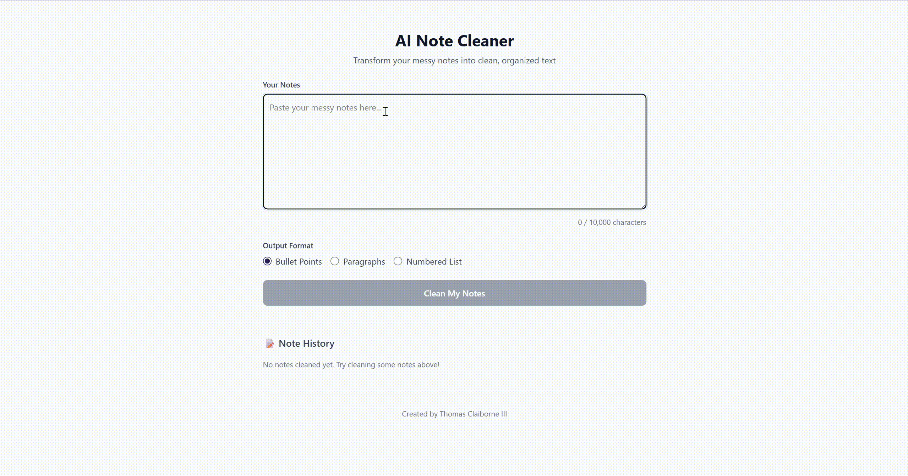

# AI Note Cleaner

A full-stack web application that transforms messy notes into clean, organized text using AI.



## Features

- **AI-Powered Cleaning** - Uses Ollama (Llama 3.2) to intelligently fix spelling, grammar, and clarity
- **Multiple Output Formats** - Bullets, paragraphs, or numbered lists
- **Note History** - View and revisit past transformations with expand/collapse
- **Copy to Clipboard** - One-click copying of cleaned notes
- **Real-time Validation** - Character limits and input validation
- **Responsive Design** - Works on desktop and mobile

## Tech Stack

| Layer | Technology |
|-------|------------|
| Frontend | React 18, TypeScript, Tailwind CSS, Vite |
| Backend | Spring Boot 3.4, Spring AI, Java 21 |
| Database | H2 (dev), PostgreSQL (prod-ready) |
| AI | Ollama with Llama 3.2 |
| Testing | JUnit 5, Mockito, MockMvc |

## Architecture
```
┌─────────────┐     ┌─────────────┐     ┌─────────────┐
│   React     │────▶│ Spring Boot │────▶│   Ollama    │
│  Frontend   │◀────│   Backend   │◀────│ (Llama 3.2) │
└─────────────┘     └──────┬──────┘     └─────────────┘
                           │
                    ┌──────▼──────┐
                    │ H2 Database │
                    └─────────────┘
```

### Request Flow

1. User enters messy notes and selects output format
2. React frontend sends POST request to Spring Boot API
3. Backend validates input and calls AiCleaningService
4. AiCleaningService builds prompt and sends to Ollama
5. Cleaned text returned to user, saved to database history

## Quick Start

### Prerequisites

- Java 21
- Node.js 18+
- Ollama with Llama 3.2 model

### Installation

1. **Clone the repository**
```bash
   git clone https://github.com/YOUR_USERNAME/ai-note-cleaner.git
   cd ai-note-cleaner
```

2. **Start Ollama**
```bash
   ollama serve
   ollama pull llama3.2
```

3. **Start the backend** (Terminal 1)
```bash
   cd backend
   ./mvnw spring-boot:run
```
   
   PowerShell:
```powershell
   cd backend
   .\mvnw spring-boot:run
```

4. **Start the frontend** (Terminal 2)
```bash
   cd frontend
   npm install
   npm run dev
```

5. **Open** http://localhost:5173

## API Endpoints

| Method | Endpoint | Description |
|--------|----------|-------------|
| POST | `/api/notes/clean` | Clean and format notes |
| GET | `/api/notes/history` | Get last 50 transformations |

### Example Request
```bash
curl -X POST http://localhost:8080/api/notes/clean \
  -H "Content-Type: application/json" \
  -d '{"content": "messy notes here", "outputFormat": "bullets"}'
```

### Example Response
```json
{
  "original": "messy notes here",
  "cleaned": "• Messy notes here",
  "outputFormat": "bullets",
  "timestamp": "2024-12-27T14:30:00.000"
}
```

### Error Responses

| Status | Meaning | Cause |
|--------|---------|-------|
| 400 | Validation failed | Empty content, invalid format, exceeds 10,000 chars |
| 503 | AI service unavailable | Ollama not running |
| 504 | AI request timeout | Model took too long |

## Project Structure
```
ai-note-cleaner/
├── backend/                      # Spring Boot API
│   ├── src/main/java/com/ainote/backend/
│   │   ├── controller/           # REST endpoints
│   │   │   └── NoteController.java
│   │   ├── service/              # Business logic
│   │   │   ├── NoteService.java
│   │   │   └── AiCleaningService.java
│   │   ├── dto/                  # Data transfer objects
│   │   │   ├── CleanRequest.java
│   │   │   ├── CleanResponse.java
│   │   │   ├── NoteHistoryResponse.java
│   │   │   └── ErrorResponse.java
│   │   ├── model/                # JPA entities
│   │   │   └── NoteHistory.java
│   │   ├── repository/           # Data access
│   │   │   └── NoteHistoryRepository.java
│   │   └── exception/            # Error handling
│   │       ├── AiServiceException.java
│   │       └── GlobalExceptionHandler.java
│   └── src/test/java/            # 28 unit & integration tests
│
├── frontend/                     # React application
│   ├── src/
│   │   ├── components/           # UI components
│   │   │   ├── NoteInput.tsx
│   │   │   ├── NoteOutput.tsx
│   │   │   ├── FormatSelector.tsx
│   │   │   ├── NoteHistory.tsx
│   │   │   ├── HistoryItem.tsx
│   │   │   ├── LoadingSpinner.tsx
│   │   │   └── ErrorMessage.tsx
│   │   ├── services/api.ts       # API client
│   │   ├── types/index.ts        # TypeScript interfaces
│   │   └── App.tsx               # Main component
│   └── public/
│       └── note-icon.svg         # Favicon
│
└── docs/                         # Documentation
    ├── ARCHITECTURE.md           # Design decisions (ADRs)
    ├── DEV_LOG.md                # Development journal
    └── INSTRUCTIONS - Phase X.md # Phase specifications
```

## Development Approach

This project was built using an **AI-native engineering workflow**:

| Phase | Focus | Outcome |
|-------|-------|---------|
| 1 | Backend API Foundation | REST endpoint with validation, placeholder logic |
| 2 | AI Integration | Spring AI + Ollama, prompt engineering |
| 3 | React Frontend | 8 components, full user workflow |
| 4 | Database Persistence | H2 database, note history feature |

### Key Practices

- **Phase-based development** - Each phase builds on the previous, ends with working feature
- **Architecture Decision Records** - All major choices documented with reasoning
- **Test coverage** - 28 tests covering service and controller layers
- **Comprehensive documentation** - DEV_LOG tracks learnings and interview prep

See [DEV_LOG.md](docs/DEV_LOG.md) for detailed session notes and learnings.

## Key Learnings

- Spring AI integration with local LLMs via Ollama
- Layered architecture with proper separation of concerns
- `@WebMvcTest` vs `@SpringBootTest` for different testing scenarios
- TypeScript/React controlled component patterns
- JPA entity design and Spring Data query methods
- CORS configuration for local development
- Prompt engineering for consistent AI outputs

## Testing
```bash
# Run all backend tests
cd backend
./mvnw test

# Run with coverage
./mvnw test jacoco:report
```

| Test Type | Count | Purpose |
|-----------|-------|---------|
| Unit (NoteServiceTest) | 11 | Service logic with mocked dependencies |
| Integration (NoteControllerTest) | 9 | HTTP layer, validation, error handling |

## Troubleshooting

### "AI service is unavailable" (503)
```bash
# Make sure Ollama is running
ollama serve

# Verify model is installed
ollama list  # Should show llama3.2
```

### Backend won't start
```bash
# Check Java version (must be 21)
java -version

# Clean and rebuild
./mvnw clean spring-boot:run
```

### CORS errors
- Access frontend at `http://localhost:5173` (not 127.0.0.1)
- Backend configured to allow this origin only

### TypeScript errors
```bash
cd frontend
rm -rf node_modules
npm install
```

## Future Enhancements

- [ ] User authentication
- [ ] Cloud deployment with Groq API
- [ ] Note search and filtering
- [ ] Export to markdown/PDF
- [ ] Dark mode
- [ ] Multiple AI model support

## Author

**Thomas Claiborne III**

*Built as a portfolio project demonstrating full-stack development with AI integration.*

## License

This project is licensed under the MIT License - see the [LICENSE](LICENSE) file for details.